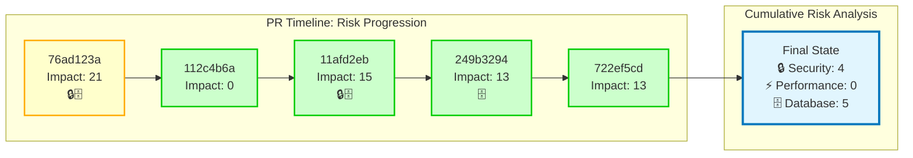
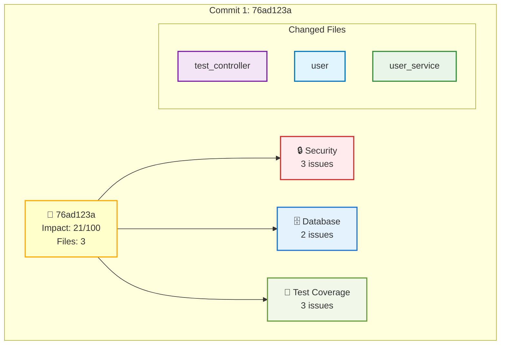
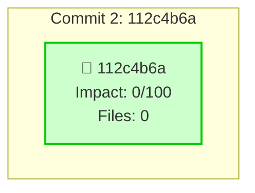
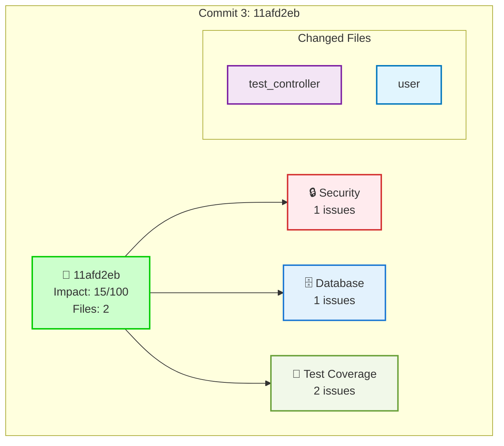
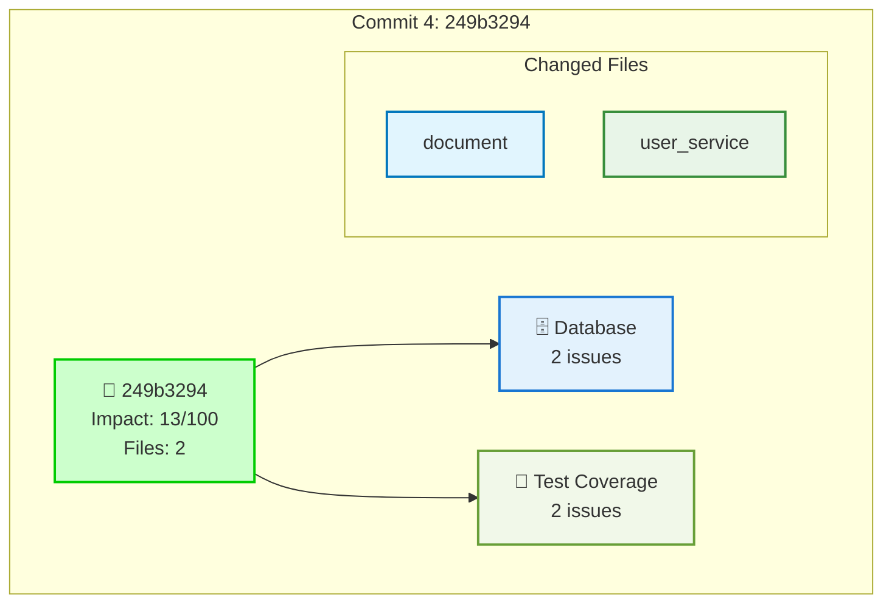
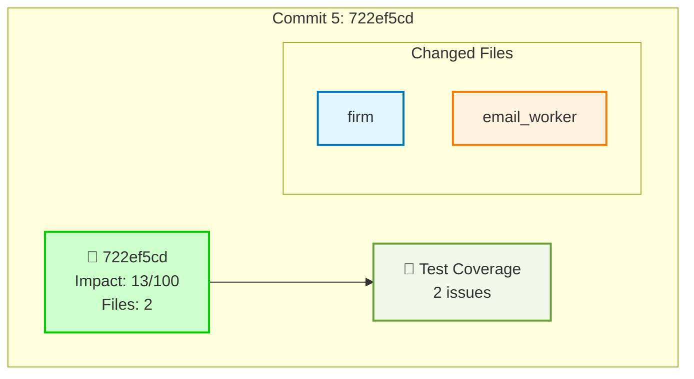
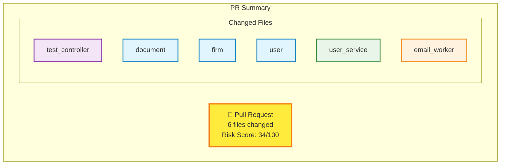

## 🔍 Automated PR Analysis

### 🟡 Risk Assessment
**AI Risk Score:** 34/100 (Medium)

**Recommendations:**
- Add tests for the changes to reduce risk

### 📈 Commit Progression Analysis

🗓️ <strong>Timeline Overview</strong>

📝 <strong>Commit 1: 76ad123a</strong> - ⚡ Add payment security enhancements with risk scenarios

**Impact Score:** 21/100
**Files Changed:** 3
**Risk Categories:** security, database, test_coverage

🔒 **Security Issues:** 3
🗄️ **Database Issues:** 2
🧪 **Test Coverage Issues:** 3

📝 <strong>Commit 2: 112c4b6a</strong> - trigger

**Impact Score:** 0/100
**Files Changed:** 0

📝 <strong>Commit 3: 11afd2eb</strong> - 🔐 Add comprehensive authentication & authorization system

**Impact Score:** 15/100
**Files Changed:** 2
**Risk Categories:** security, database, test_coverage

🔒 **Security Issues:** 1
🗄️ **Database Issues:** 1
🧪 **Test Coverage Issues:** 2

📝 <strong>Commit 4: 249b3294</strong> - 💳 Integrate comprehensive payment gateway system

**Impact Score:** 13/100
**Files Changed:** 2
**Risk Categories:** database, test_coverage

🗄️ **Database Issues:** 2
🧪 **Test Coverage Issues:** 2

📝 <strong>Commit 5: 722ef5cd</strong> - 📊 Add comprehensive performance monitoring & optimization system

**Impact Score:** 13/100
**Files Changed:** 2
**Risk Categories:** test_coverage

🧪 **Test Coverage Issues:** 2

### 📊 Change Statistics
- **Files Changed:** 0
- **Models:** 0
- **Controllers:** 0
- **Services:** 0

### ⚠️ Issues Found
- **Performance Risks:** 4
- **Security Risks:** 1
- **Database Impacts:** 3

### 📋 Detailed Reports
View the complete analysis in the generated reports:
- [Risk Assessment](./docs/system-diagrams/reports/pr_risk_assessment.md)
- [Impact Summary](./docs/system-diagrams/reports/pr_impact_summary.md)
- [Visual Diagram](./docs/system-diagrams/reports/enhanced_pr_report.md)
- [📈 Timeline Analysis](./docs/system-diagrams/reports/pr_timeline.md)
- [📚 Commit Analysis Index](./docs/system-diagrams/commits/index.md)

🎯 View Overall Dependency Diagram

---
_Generated by System Visualizer at 2025-08-01 10:38:05_