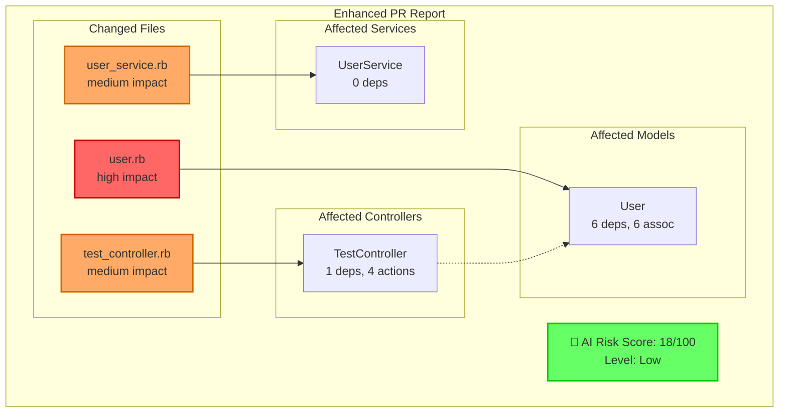

## 🔍 Automated PR Analysis

### 🟢 Risk Assessment
**AI Risk Score:** 18/100 (Low)

**Recommendations:**
- Add tests for the changes to reduce risk

### 📊 Change Statistics
- **Files Changed:** 3
- **Models:** 1
- **Controllers:** 1
- **Services:** 1

### ⚠️ Issues Found
- **Security Risks:** 1
- **Database Impacts:** 2

### 📋 Detailed Reports
View the complete analysis in the generated reports:
- [Risk Assessment](./docs/system-diagrams/reports/pr_risk_assessment.md)
- [Impact Summary](./docs/system-diagrams/reports/pr_impact_summary.md)
- [Visual Diagram](./docs/system-diagrams/reports/enhanced_pr_report.md)
- [📈 Timeline Analysis](./docs/system-diagrams/reports/pr_timeline.md)
- [📚 Commit Analysis Index](./docs/system-diagrams/commits/index.md)

🎯 View Dependency Diagram

---
_Generated by System Visualizer at 2025-08-01 10:09:31_