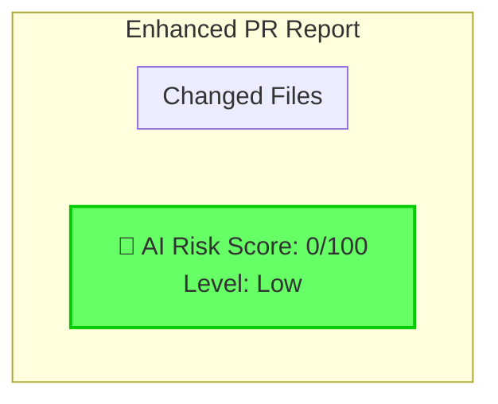

## 🔍 Automated PR Analysis

### 🟢 Risk Assessment
**AI Risk Score:** 0/100 (Low)

### 📊 Change Statistics
- **Files Changed:** 0
- **Models:** 0
- **Controllers:** 0
- **Services:** 0

### 📋 Detailed Reports
View the complete analysis in the generated reports:
- [Risk Assessment](./docs/system-diagrams/reports/pr_risk_assessment.md)
- [Impact Summary](./docs/system-diagrams/reports/pr_impact_summary.md)
- [Visual Diagram](./docs/system-diagrams/reports/enhanced_pr_report.md)

🎯 View Dependency Diagram

---
_Generated by System Visualizer at 2025-08-01 09:53:30_